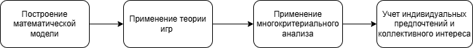

---
## Front matter
lang: ru-RU
title: Доклад по математическому моделированию
subtitle: Совместное принятие решений
author:
  - Сидорова Н.А.
teacher:
  - Дмитрий Сергеевич Кулябов, доктор физико-математических наук, профессор
institute:
  - Российский университет дружбы народов, Москва, Россия
  - Объединённый институт ядерных исследований, Дубна, Россия
date: 30 марта 2025

## i18n babel
babel-lang: russian
babel-otherlangs: english

## Formatting pdf
toc: false
toc-title: Содержание
slide_level: 2
aspectratio: 169
section-titles: true
theme: metropolis
header-includes:
 - \metroset{progressbar=frametitle,sectionpage=progressbar,numbering=fraction}
---

# Информация

## Докладчик

:::::::::::::: {.columns align=center}
::: {.column width="70%"}

  * Сидорова Наталья Андреевна
  * НфИбд-01-22
  * Российский университет дружбы народов
  * [1132226432@pfur.ru](mailto:1132226432@pfur.ru)
  * <https://nasidorova.github.io/ru/>

:::
::: {.column width="30%"}

:::
::::::::::::::

# Вводная часть

## Актуальность темы
В современных условиях принятие решений часто становится коллективной задачей из-за неопределенности и множества заинтересованных сторон. Это актуально для управления, экономики, здравоохранения и других сфер. Рост информационной нагрузки и разнообразие мнений подчеркивают важность эффективных методов коллективного решения.
	
## Объект и предмет исследования
Объект исследования: процессы коллективного принятия решений в сложных системах.
Предмет исследования: методы математического моделирования, используемые для анализа и оптимизации коллективных решений, а также алгоритмы, способствующие нахождению консенсуса.

## Гипотеза
Применение интегрированного подхода, объединяющего методы многокритериального анализа и теорию игр, позволит добиться более эффективного и устойчивого консенсуса в ситуациях, характеризующихся сложной динамикой и неопределенностью.
	
## Материалы исследования
1. Литературный обзор по методам принятия решений, теории игр и многокритериальному анализу.
2. Данные, полученные из кейс-исследований в области управления проектами и корпоративного управления.

## Методы и инструменты
1. Математическое моделирование
2. Теория игр
3. Методы оптимизации и многокритериального анализа
4. Численные методы
5. Статистический анализ для оценки параметров и поведения модели.

# Основная часть

## Содержание исследования

{#fig:002 width=70%}

## Основные этапы работы

{#fig:003 width=70%}

## Анализ результатов

1. В результате моделирования получены характеристики оптимального выбора, позволяющие наблюдать динамику формирования консенсуса среди агентов.
2. Анализ чувствительности модели к изменению входных параметров показал устойчивость результатов при определенной вариации.
3. Сравнение с традиционными методами коллективного решения выявило преимущество предложенной интегрированной модели в условиях высокой неопределенности и многокритериальности.

## Вывод

1. Интеграция методов теории игр и многокритериального анализа позволяет более точно описывать и оптимизировать процессы коллективного принятия решений.
2. Разработанная математическая модель является надежным инструментом для анализа и поддержки решения в условиях неопределенности и сложных взаимосвязей.
3. Практическая реализация модели подтверждает её эффективность и перспективность для использования в реальных управленческих и проектных процессах.
4. Дальнейшие исследования могут быть направлены на улучшение алгоритмов коммуникации между участниками и адаптацию модели под специфические отраслевые задачи.

:::

